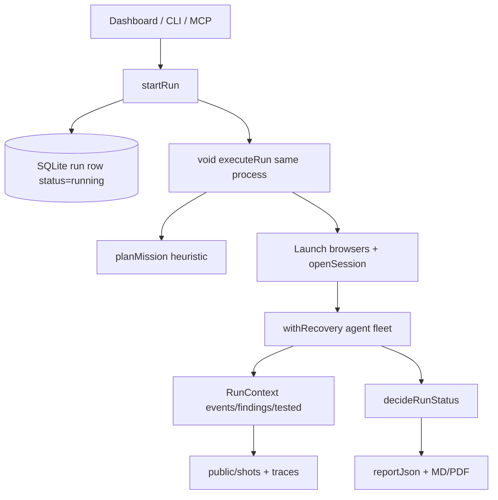

# Webtester Architecture, Reliability, AI, Security, UI, and Production-Readiness Audit

**Project:** `D:\Projects\testing\webtester`  
**Audit date (original):** 2026-07-29  
**Full re-audit (code + live UI):** 2026-07-30  
**Audited state:** Current working tree  
**Method:** Read-only source review from TypeScript/TSX only (plan/docs used only as claims to verify, never as evidence) + `tsc` / `lint` / `agents:test` / `db:cleantest` / `build` / `npm audit` + live browser inspection of `localhost:3400`  
**Source changes made by this audit:** None except this report file.

---

## 1. Executive verdict

Webtester is a capable **local, same-process** black-box QA orchestrator: Playwright multi-browser/multi-role sessions, ~34 deterministic agent modules, optional AI review (smart/full), SQLite history, screenshots/traces, live CDP view, CLI/MCP, and a strong assert self-test suite (**95** `selftest OK` sections).

It is **not** a durable job system, **not** multi-tenant, and **not** an exhaustive “senior tester that does everything.” The mission planner is **heuristic** (`planMission` in `planner.ts`) — no LLM planner exists in code. AI is an optional post-crawl layer gated by mode + API keys.

### What improved since the first audit (verified in code)

Prior P0 correctness bugs are largely closed:

| Prior P0 | Code status |
|---|---|
| P0-1 fresh DB schema | ✅ holds — full `CREATE TABLE` + `db:cleantest` |
| P0-2 coverage/verdict honesty | ✅ holds — `sampleFor` does not stamp coverage; `observe()` does; `decideRunStatus` + `inconclusive` |
| P0-3 journey false-pass | ✅ holds — goal oracle, origin lock, failed expect ends journey |
| P0-4 delete during active run | 🟡 partial — `hasActiveRun` / terminal-wait guards hold, but there is no lease/tombstone (matches §1b; the earlier ✅ here was inconsistent) |
| P0-5 static home dashboard | ✅ holds — `export const dynamic = "force-dynamic"`; build shows `ƒ /` |
| P0-6 SaaS boundary | ✅ (product decision) — local single-user positioning |

### Why it still is not “perfect”

The remaining gap is no longer “does the verdict lie by default?” — it is:

1. **Execution model:** `void executeRun(...)` in the Next/Node process — no worker, no durable queue (P1-1).
2. **Evidence contract holes:** crawler still stamps `route-health` coverage before that agent runs; journey stamps coverage before action success; resume can mis-align on duplicate agent names / `Promise.all` finish order.
3. **UI trust gap:** report stores `statusReason` / `agentsFailed` / `executionOutcome`, but the dashboard **never renders them**. Status honesty in the UI still lags the runner.
4. **Security model:** no app auth; read APIs open; artifacts under `public/`.

### Readiness by deployment target

| Target | Verdict |
|---|---|
| Local, single trusted user | **Usable beta.** Prefer after understanding process-bound runs and SQLite limits. |
| Trusted internal team (shared host) | **Not ready** without auth, private artifacts, concurrency control, durable worker. |
| Multi-tenant SaaS | **Unsafe.** |
| Vercel/serverless | **Architecturally incompatible** (in-process browsers + writable SQLite + `public/` writes). |

### Recommended positioning

> A local autonomous black-box regression assistant with deterministic agents and optional AI-assisted review.

Do not market as an exhaustive senior-tester replacement.

---

## 1b. Remediation status — as of re-audit 2026-07-30

**Legend:** ✅ fixed and re-verified in code · 🟡 partial · ❌ open · 🆕 new this re-audit

### Prior P0 — closed

| ID | Status | Notes |
|---|---|---|
| P0-1 | ✅ | `db.ts` initial schema + `npm run db:cleantest` |
| P0-2 | ✅ | `context.sampleFor` / `observe` / `verdict.decideRunStatus` |
| P0-3 | ✅ | `journey.ts` oracle + action failure semantics |
| P0-4 | 🟡 | Delete guards exist; no `stopping`/`deleting` states or AbortSignal lease |
| P0-5 | ✅ | Home is dynamic; build route table shows `ƒ /` |
| P0-6 | ✅ | Boundary decision; no auth added (correct for local-only) |

### Prior P1 — major remaining

| ID | Status | Notes |
|---|---|---|
| P1-1 durable jobs | ❌ | Still `void executeRun` (`orchestrate.ts`) |
| P1-2 concurrent runs | 🟡 | Per-project `hasActiveRun`; TOCTOU race; multi-project OK |
| P1-3 stop granularity | 🟡 | `checkCancelled` at gates; long agent bodies continue |
| P1-4 live view owner | ✅ | Sticky ownership in control plane |
| P1-5 screencast I/O | 🟡 | Async queue; no viewer-gated throttle / SSE backpressure |
| P1-6 page-first pipeline | ❌ | Still agent-first orchestration |
| P1-7 visual baselines | 🟡 | Role+profile+viewport+route keys; candidates not overwrite |
| P1-8 artifact failures | 🟡 | Warn logs; no typed `artifactStatus` in UI |
| P1-9 AI timeout/ledger | 🟡 | Timeouts exist; no run cost ledger / hard budget gate |
| P1-10 AI schema validate | ✅ | `validateToolOutput` in AI tool path |
| P1-11 thin AI evidence | ❌ | Citation / current-run evidence IDs not enforced |
| P1-12 verdict/suppression | ✅ | `decideRunStatus` + feedback partition |
| P1-13 permission FPs | ✅ | `unknown` relationship + softer discovery findings |
| P1-14 public artifacts | 🟡 | Deletes clean files; still served from `public/` |
| P1-15 live-view token | 🟡 | Routes share `controlAllowed`; EventSource cannot send token |
| P1-16 deps | ✅ | `next@^16.2.12`; `npm audit --omit=dev` = 0 |
| P1-17 report view derive | ✅ | `report-view.ts` |
| P1-18 partial report | 🟡 | Crash/cancel writes partial `reportJson`; thin retained state |
| P1-19 terminal poll refresh | ✅ | LiveRun refreshes on terminal transition |
| P1-20 report CLI column | ✅ | `started_at` |

### New findings this re-audit

Every claim below was independently re-verified against the cited code before any fix
was written, and each was accurate. Status column added after remediation the same day
(gate: `tsc` 0 · lint 0 · **96 selftest sections** · clean-DB · build · 0 audit vulns).

| ID | Sev | Title | Status |
|---|---|---|---|
| **UI-1** | 🔴 | `statusReason` / `agentsFailed` / `executionOutcome` never rendered | ✅ New "Why this verdict" card on the run page: status, reason, `partial` execution warning, and failed agents listed as *tester* failures separate from app findings |
| **UI-2** | 🔴 | Poll `setRun(runRes)` trusts any JSON (404 `{error}` corrupts page) | ✅ `isRunPayload()` requires the payload to carry this run's id and a known status before it replaces state; otherwise a connection banner shows and the last good state is kept |
| **UI-3** | 🔴 | Dishonest empty/copy: "still working" / "Running…" after terminal | ✅ Empty-findings copy now branches on status (passed / inconclusive / cancelled / error); the run list no longer prints "Running…" for a terminal run |
| **UI-4** | 🟡 | Silent control/question POST failures | ✅ Both control POSTs check `response.ok` and surface the failure — an answer that never arrived no longer looks sent |
| **UI-5** | 🟡 | `?error=active-run` / `still-stopping` never shown | ✅ Project page renders an explanatory banner for each refusal |
| **UI-6** | 🟡 | StatusBadge: `failed`≡`error`, `inconclusive`≡`cancelled` visually | ✅ Distinct colour per status, plus a glyph and a `title` explaining the meaning (no reliance on colour alone) |
| **A-1** | 🟡 | Crawler stamps `route-health` coverage before route-health agent (`crawler.ts:251`) | ✅ Crawler records only its own coverage, only on a page it actually opened; `routeHealthAgent` stamps its dimension as it examines each page |
| **A-2** | 🟡 | Journey `recordTested` every loop before action success | ✅ Coverage recorded only once the page yielded a semantic digest |
| **A-3** | 🟡 | Resume + duplicate agent names / `Promise.all` order can skip or over-rerun | ✅ `skipCompleted` refuses to skip at the first repeated agent name — re-running is safe, skipping the wrong step is not. Selftested both ways |
| **A-4** | 🟡 | `queued` status is dead — `createRun` always inserts `running` | ❌ Left as-is deliberately: it becomes meaningful with the P1-1 job queue, and inventing a queued state now would be cosmetic |
| **A-5** | 🟡 | Primary-profile login not under `withRecovery` | ✅ Wrapped like the extra-profile logins, so a thrown login is recorded in `agentsFailed` → inconclusive instead of aborting the run |
| **A-6** | 🟡 | Post-browser root-cause/senior-review can wipe near-complete report on late cancel | ✅ The report is checkpointed before the optional AI addenda; the outer handler now marks that checkpoint `partial` instead of overwriting it with a skeleton |
| **A-7** | 🔵 | MCP hardcodes `envTag: "production"` (disables CRUD/upload probes) | ✅ Now an explicit tool input, still defaulting to the safe `production` value |
| **S-1** | 🔴 (SaaS) | No middleware / app auth; unguarded read APIs | ❌ Accepted under the declared local-single-user boundary (P0-6). Blocker before any shared host |
| **S-2** | 🔴 (SaaS) | Screenshots/traces/baselines under `public/` | 🟡 Deleted with their run/project, still world-readable while they exist — the private artifact store (P1-14) is still open |
| a11y | 🟡 | Role credential inputs had placeholders only | ✅ `aria-label` on all three; `animate-pulse` now respects `motion-reduce` |

---

## 2. What was inspected (code-first)

### Included

- `src/app/**` pages, Server Actions, API routes
- `src/components/**`
- `src/lib/db.ts`, `types.ts`, `crypto.ts`, `originGuard.ts`, `report-view.ts`
- `src/lib/runner/**` (orchestrate, context, verdict, planner, recovery, control, ai, agents)
- `package.json`, CI workflow, selftest, clean-db script
- Live UI on `http://localhost:3400` (dashboard, new project, finished SaaS bench run)

### Explicitly not used as evidence

- Claims inside `ARCHITECTURE.md`, `PLAN-V8.md`, `PLAN-REPORT-TRUST.md`, `README.md` were treated as hypotheses only.
- Benchmark was not re-run *by this audit pass* (it mutates DB/artifacts). **Correction (verified 2026-07-30):** the seeded benchmark WAS executed twice that day around the verdict/evidence rewrite — **18/26 (69%) both before and after** (saas 7/11, content 6/8, spa 5/7; 95 then 100 total findings). So the 69% is a re-measured post-change result, not merely historical, and it establishes that the honesty work cost no detection. Real-site recall/precision remain unmeasured.
- Secrets in `.env` / `.env.local` were not read.

---

## 3. Fresh verification results (2026-07-30)

| Check | Result | Detail |
|---|---|---|
| `npx tsc --noEmit` | **Pass** | 0 errors |
| `npm run lint` | **Pass** | 0 errors |
| `npm run agents:test` | **Pass** | **95** `selftest OK` sections |
| `npm run db:cleantest` | **Pass** | Fresh schema + query + idempotent re-init |
| `npm run build` | **Pass** | `/` is `ƒ` (dynamic). Warning: overly broad `public/shots` patterns |
| `npm audit --omit=dev` | **Pass** | 0 vulnerabilities |
| Live UI | **Inspected** | Dashboard, `/projects/new`, finished run `bench-saas` / `nX33GKasElY-hdSMrfADs` |
| Agent modules | **34** | `src/lib/runner/agents/*.ts` |
| Next version | **^16.2.12** | From `package.json` |

### Build route table (excerpt)

```text
┌ ƒ /
├ ○ /_not-found
├ ƒ /api/runs/[id]
├ ƒ /api/runs/[id]/events|findings|frames|input|questions|report
├ ƒ /projects/[id]
├ ƒ /projects/[id]/runs/[runId]
└ ○ /projects/new
```

---

## 4. Architecture (from code, not docs)

### Stack

| Layer | Technology (from `package.json` + imports) |
|---|---|
| UI | Next.js App Router, React 19, Tailwind 4, Geist fonts |
| Control | Server Actions (`actions.ts`) + JSON APIs under `src/app/api` |
| Execution | Same Node process: `startRun` → `void executeRun` |
| Browser | Playwright Chromium/Firefox/WebKit |
| DB | `better-sqlite3` WAL → `data/webtester.db` |
| AI | Anthropic SDK and/or OpenRouter HTTP (`ai.ts`) |
| A11y / perf | axe-core; Lighthouse via chrome-launcher |
| Artifacts | `public/shots`, `public/traces`, `public/baselines`, `data/reports` |
| External | MCP stdio (`mcp.ts`), CLI (`cli.ts`), bench (`bench/run.ts`) |

### Run lifecycle



### Mission planner (actual behavior)

`planMission` (`planner.ts`) is **deterministic heuristics**:

| Mode | Pages/role | AI budget | Device profiles |
|---|---|---|---|
| quick | 3 | 0 (AI off) | Desktop Chrome |
| smart | 6 | 20k | Chrome + Mobile Chrome |
| full | 12 | 60k | Chrome, Firefox, Safari, Mobile Chrome, Mobile Safari |

**Always-scheduled deterministic core:** login, crawler, site-classifier, route-health, api-mapper, api-validation, analytics, interaction, page-expectations, form-validation, data-integrity, ui-audit, visual, a11y, perf, security, seo, root-cause, regression.

**Conditional:** permissions (2+ roles), register, email-flows, file-upload, crud/resilience/chaos/memory-leak (full / non-prod gates), journey/requirements/page-judge/ai-reviewer/senior-review/explorer (smart|full + AI key).

There is **no** LLM mission planner in the codebase.

### Local agents vs AI

- **Without AI (quick, or no key):** full deterministic fleet still runs — crawl, interact, a11y, security headers, permissions matrix, etc.
- **With AI (smart/full + key):** adds journey engine, requirements check, page-judge, AI reviewer, senior review, optional explorer; plus optional cross-model verify when `AI_VERIFY_MODEL` is set.

### Verdict policy (code)

```text
FAIL          ← unsuppressed, non-refuted, kind=bug, severity critical|high
else INCONCLUSIVE ← agentsFailedCount > 0
else PASS
```

Implemented in `verdict.ts`; wired in `orchestrate.ts` into `report.statusReason`, `agentsFailed`, `executionOutcome`.

---

## 5. Plan assessment (code vs intended product)

| Plan claim (docs / product intent) | Code reality |
|---|---|
| AI can plan the mission | Heuristic only (`planner.ts` comment: LLM planner deferred) |
| Full website testing | Sampled pages by mode (3/6/12); not exhaustive crawl of every URL for every agent |
| Senior tester replacement | Strong local assistant; recall/precision on real sites not measured this audit |
| Durable/reliable runs | Process-bound; orphan sweep via heartbeat (~5 min) |
| Honest PASS/FAIL | Runner-side largely fixed; **UI does not surface why** |
| Live human-in-the-loop | Works locally; hosted token + EventSource gap remains |
| Page-first ObservationBundle | Not implemented — agent-first loops remain |

**Bottom line on the plan:** The deterministic fleet + optional AI layer is real and substantial. The plan’s largest unfinished architectural pieces are still **durable execution (P1-1)** and **page-first evidence (P1-6)**. Trust work (verdict/journey/coverage) was pulled forward and largely landed in the runner — then stopped short of the UI.

---

## 6. Finding detail — architecture & reliability

### 🔴 A/UI trust: status reason invisible (UI-1)

**Location:** `types.ts` / `orchestrate.ts` write fields; `LiveRun.tsx` / project pages never read them.

**Evidence:** Finished run `nX33GKasElY-hdSMrfADs` has:

```json
{
  "statusReason": "11 unsuppressed critical/high bug finding(s)",
  "agentsFailed": [],
  "executionOutcome": "completed"
}
```

UI shows badge `failed` + summary paragraph only — no `statusReason`, no failed-agent list, no partial/completed outcome.

**Why it matters:** After P0-2, `inconclusive` is a first-class honesty status. Without UI explanation it looks like a vague amber cancel twin (see UI-6).

### 🔴 Poll corrupts run state (UI-2)

**Location:** `LiveRun.tsx` ~130 — `setRun(runRes)` after `GET /api/runs/:id`.

**API:** `api/runs/[id]/route.ts` returns `{ error: "not found" }` on 404 with **no** `ok` check client-side.

**Fix direction:** Require `runRes?.id === run.id` (and a known status) before `setRun`; show reconnect/error banner on failure.

### 🔴 Dishonest copy (UI-3)

| Location | Problem |
|---|---|
| `projects/[id]/page.tsx:56` | `r.summary?.split("\n")[0] ?? "Running…"` — terminal runs with empty summary still say Running |
| `LiveRun.tsx:890` | Zero findings → “agents are still working” even when status is `passed`/`failed`/`inconclusive` |

### 🟡 Coverage honesty regressions (A-1, A-2)

- **A-1** `crawler.ts:251`: `ctx.recordTested(norm, "route-health")` during crawl. Coverage matrix can claim functional `route-health` even if that agent later fails or never runs.
- **A-2** `journey.ts:223`: `recordTested` each loop iteration before the action succeeds.

P0-2 fixed *selection-as-coverage* via `sampleFor`; these remaining stamps reintroduce inflation on specific agents.

### 🟡 Resume correctness (A-3)

`skipCompleted` matches agent names by ordinal position (`context.ts:124–131`). Orchestrator registers multiple `withRecovery(ctx, "permissions", …)` and parallel `Promise.all` agents that emit `agent-done` in completion order. Resume can skip the wrong slot or clear resume and over-rerun.

### 🟡 Dead `queued` status (A-4)

`RunStatus` includes `queued`, but `createRun` always writes `running`. LiveRun only polls while `status === "running"`. Orphan/cancel helpers still special-case `queued` — dead code path.

### 🟡 Login outside recovery (A-5)

Primary `openSession` calls `loginAgent` directly (`orchestrate.ts`). Secondary profiles wrap login in `withRecovery`. A thrown login error aborts the whole run instead of recording `agentsFailed` → inconclusive.

### 🟡 Late cancel can replace report (A-6)

After browsers close, root-cause / senior-review / `updateRun` still run. Cancel/crash in that window hits the outer catch and can replace a near-complete `reportJson` with a minimal partial.

### ❌ P1-1 Durable jobs (still the largest architecture gap)

```text
startRun → createRun("running") → void executeRun(...).catch(...)
```

Dev server restart, deploy, or OOM kills in-flight work. Heartbeat orphan marking is a safety net, not a job system.

---

## 7. UI audit (code + live screenshots)

### Information architecture

```text
/                     project cards (severity from last terminal run)
/projects/new         create-only form (no edit later)
/projects/:id         launcher + runs + graph stats
/projects/:id/runs/:id  LiveRun client shell (poll + SSE + findings)
```

No settings, auth, project edit, custom `not-found`, or surfaces for OWASP matrix / agentsFailed / statusReason.

### Visual / design (live)

- Dark “mission control” theme (`globals.css`): indigo/violet accents, dotted grid, Geist — competent but clustered with the common AI-dashboard look.
- Home cards are clear and scannable (verified live with 5 projects).
- New project form is long but labeled well for core fields; journeys remain a raw JSON textarea (hostile DX).
- Run page is a **dense vertical stack of Cards**: summary → live view → agent chips → coverage → lighthouse → findings. Weak visual priority; findings compete with live chrome.
- Footer correctly states local / encrypted credentials.

### Accessibility

- Role credential inputs on create form: **placeholders only**, no `<label>` / `htmlFor` (`ProjectForm.tsx:134–136`).
- Findings/timeline toggles are plain buttons — not `role="tablist"`.
- Evidence images use `alt=""`.
- Lightbox is not a proper dialog (no Esc/focus trap observed in code).
- `prefers-reduced-motion` ignored (`animate-pulse` on running badge/chips).
- Muted text `#8b93a7` with `/40`–`/50` opacity risks WCAG contrast failures.

### Live-run UX

| Topic | Assessment |
|---|---|
| Polling | Self-scheduling 1.5s — good; only while `running` |
| Frames | SSE + `/shots/.../live.jpg` fallback; EventSource cannot send control token |
| Questions | Origin/token guarded; failures silent; only one pending shown |
| Take control | Works when liveFrame present; pinning a role disables live stream + control |
| Warmup | Live section mounts only after first shot/frame — no “waiting for first frame” |

### Ranked UI defects

1. 🔴 UI-1 statusReason / agentsFailed invisible  
2. 🔴 UI-2 unvalidated poll JSON  
3. 🔴 UI-3 dishonest empty / Running copy  
4. 🟡 UI-4 silent POST failures  
5. 🟡 UI-5 error query params unused  
6. 🟡 UI-6 badge style collisions  
7. 🟡 No project edit; journeys as JSON  
8. 🟡 a11y gaps (roles, tabs, alts, motion)  
9. 🔵 Card-stack clutter / indigo-glow aesthetic  
10. 🔵 Delete run uses `window.confirm` while project uses `ConfirmDialog`

### StatusBadge coverage

All seven `RunStatus` values are typed and styled (`StatusBadge.tsx`), including `inconclusive`. Support ≠ clarity: visual twins hide meaning.

---

## 8. Security (from code)

| Issue | Local solo | Shared / SaaS |
|---|---|---|
| No `middleware.ts`, no app auth | Acceptable by product boundary | 🔴 Blocker |
| Unguarded `GET` run/events/findings/report/graph | Same-machine risk low | 🔴 Anyone with URL |
| Artifacts in `public/shots|traces|baselines` | Same | 🔴 Static leak of screenshots of logged-in apps |
| Control routes (`input`/`questions`/`frames`) use `controlAllowed` | ✅ loopback-friendly | 🟡 token + EventSource gap |
| Credentials AES-GCM at rest (`crypto.ts` + `data/secret.key`) | ✅ for single machine | 🟡 not multi-tenant KMS |
| Target URL limited to http(s) in actions | ✅ | SSRF-like probing of user-chosen origins is intentional for a tester |
| AI keys from env only | ✅ | — |

For the declared **local single trusted user** boundary, the critical SaaS items are accepted risk — but the footer and README must stay honest. Exposing port 3400 on a LAN without auth is already unsafe.

---

## 9. Agent fleet inventory (34 modules)

| Module | Role (code) |
|---|---|
| login | Auth / storage-state / anon sessions |
| crawler | Discover pages + graph |
| classifier | Page types |
| interaction | Click/explore controls |
| expectations | Page expectation heuristics |
| routeHealth | Broken routes / console / network |
| apiMapper / apiValidation | API surface + shape |
| formValidation / dataIntegrity | Forms & data smells |
| security (+ ZAP optional) | Headers / baseline scan |
| a11y / uiAudit / seo / visual / perf (+ Lighthouse) | Quality dimensions |
| permissions (+ write-IDOR, rel-authz) | Cross-role |
| register / emailFlows / fileUpload / crud | Stateful flows (gated) |
| learning / resilience / chaos / memory | Full-mode probes |
| regression / rootCause | Diff + clustering (+ repo-aware) |
| journey / requirements / explorer / pageJudge / aiReviewer / seniorReviewer | AI layer |
| analytics | Analytics presence heuristics |

Scheduling order is hardcoded in `orchestrate.ts` (primary profile → permissions → extra devices → post-discovery → AI block → regression).

---

## 10. Self-test & CI coverage vs gaps

**Covered well by `agents:test`:** pure helpers (URL templates, verdict, journey oracle, fingerprints, OWASP map, feedback partition, live ownership, recovery, etc.).

**Not covered (integration / UI / process):**

- Concurrent `startRun` TOCTOU  
- Resume with duplicate agent names  
- LiveRun poll error JSON  
- UI statusReason rendering  
- Process kill mid-run  
- Real-site flake / FP rate  
- EventSource + control token hosted path  

CI (`.github/workflows/ci.yml`) runs typecheck, lint, clean-DB, selftests, build, dependency audit — good for a local tool; does not close the gaps above.

---

## 11. Production-readiness scorecard

| Area | Score | Note |
|---|---|---|
| Deterministic agent depth | High | Broad fleet, real Playwright |
| Runner verdict honesty | High | After P0-2 / P1-12 |
| UI status honesty | Low–Med | Badge exists; reason/agentsFailed missing; bad empty copy |
| Durability | Low | Same-process fire-and-forget |
| Concurrency | Low–Med | Soft per-project mutex |
| Artifact privacy | Low | `public/` |
| Auth / tenancy | None | By design for local |
| AI quality controls | Med | Schema validate + timeouts; thin citations; no cost ledger |
| Docs vs code | Med | Runner fixed faster than ARCHITECTURE.md (not re-audited as evidence) |
| Automated pure tests | High | 95 sections, green |
| Eval / recall proof | Unverified | Bench not re-run this audit |

**Overall:** Strong local prototype that fixed its worst correctness lies in the runner. Still imperfect because **UI trust, durable jobs, coverage edge stamps, and public artifacts** remain. Not production-team or SaaS ready.

---

## 12. Recommended next work (priority order)

### P0 for “trustworthy local beta”

1. **Render `statusReason`, `agentsFailed`, `executionOutcome`** on LiveRun + project run list.  
2. **Validate poll payloads** before `setRun`; show connection-error state.  
3. **Fix dishonest empty/Running copy** based on `run.status`.  
4. **Stop stamping `route-health` in crawler**; only stamp after route-health succeeds.  
5. **Surface `?error=`** on project/run pages.

### P1 architecture

6. Durable worker + job queue (P1-1) — largest remaining structural item.  
7. Resume keyed by unique step IDs, not repeated agent names.  
8. Private artifact root + authorized download (P1-14).  
9. Page-first ObservationBundle (P1-6) if coverage honesty is a product promise.  
10. EventSource auth via HttpOnly cookie or nonce (P1-15).

### P2 UX polish

11. Project edit; structured journey builder.  
12. Distinct badge styles for failed vs error vs inconclusive vs cancelled.  
13. a11y pass (labels, tabs, alts, reduced motion).  
14. Live-view warmup placeholder; toast on control/question errors.

---

## 13. Release gates (unchanged intent, still unmet)

Do not claim production readiness until:

- [ ] Durable worker survives process restart without silent data corruption  
- [ ] UI always shows why a run passed / failed / inconclusive  
- [ ] Coverage matrix never claims an agent that did not successfully observe  
- [ ] Artifacts not world-readable from `public/` on any shared host  
- [ ] Repeated bench + measured FP precision documented from **code-run** results  
- [ ] Auth story exists **if** the product leaves single-user localhost  

---

## 14. Review summary

| Severity | Count (open / new emphasis) |
|---|---|
| 🔴 Critical (for stated local trust / SaaS) | UI-1, UI-2, UI-3 (+ S-1/S-2 if exposed beyond localhost) |
| 🟡 Warning | A-1–A-6, UI-4–UI-6, remaining P1 partials |
| 🔵 Suggestion | A-7, visual polish, journey form UX |

**Overall:** The previous audit was directionally right but **stale** — many P0 runner defects are fixed and verified green (`tsc`, lint, 95 selftests, clean DB, dynamic `/`, 0 prod audit vulns). The product is still not perfect: the honesty work stopped in the runner and never finished in the UI; architecture remains a same-process prototype; coverage still has agent-specific stamp bugs.

**Next priority:** Ship UI trust (statusReason / agentsFailed / poll validation / honest empty states) before more agents. Then durable jobs.
